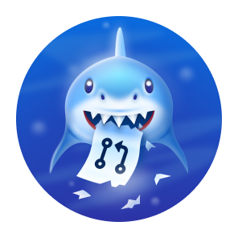
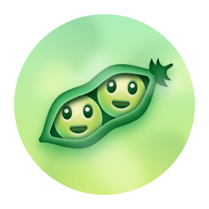

# GitHub Achievements Catalog

Track GitHub profile badges and achievements, including which ones are still earnable, which ones are retired, and which ones are only community-reported.

Last verified: **2026-04-06**

## Scope

- This repo focuses on profile-visible GitHub badges and achievements.
- This catalog is intentionally kept as a static reference so everything stays visible directly in this README.
- It separates **officially documented** items from **mixed** and **community-reported** items.
- GitHub does **not** publish a complete official achievements catalog, so some rows are marked with lower confidence on purpose.
- Community rows are useful, but you should treat them as best-effort guidance rather than guaranteed GitHub policy.

## Snapshot

- Total tracked items: **16**
- Obtainable: **12**
- Retired: **2**
- Unreleased / undocumented: **2**
- Official rows: **9**
- Mixed-confidence rows: **2**
- Community rows: **5**

## Confidence Legend

- **Official**: backed directly by GitHub Docs, GitHub Blog, GitHub Changelog, or GitHub-owned program pages.
- **Mixed**: GitHub officially shows the name or concept, but the detailed unlock rule is community-maintained.
- **Community**: widely reported in the GitHub community, but not formally documented by GitHub.

## Officially Documented Items

| Icon | Name | Type | Status | Earn now? | How to get / known criteria | Notes |
| --- | --- | --- | --- | --- | --- | --- |
|  | Developer Program Member | Profile badge |  Obtainable |  Yes | Join the GitHub Developer Program and build an app with the GitHub API. | Shown as a profile badge, not an achievement. The badge depends on active program participation. |
|  | PRO | Profile badge |  Obtainable |  Yes | Use GitHub Pro. | Shown while the account has GitHub Pro. |
|  | Security Bug Bounty Hunter | Profile badge |  Obtainable |  Yes | Help GitHub find security vulnerabilities through the security program. | Not a general-purpose badge; it depends on accepted security work. |
|  | GitHub Campus Expert | Profile badge |  Obtainable |  Yes | Participate in the GitHub Campus Experts program. | Program badge for accepted Campus Experts. |
|  | Security advisory credit | Profile badge |  Obtainable |  Yes | Submit a security advisory accepted into the GitHub Advisory Database. | Shown as a profile badge, not an achievement. |
|  | Arctic Code Vault Contributor | Achievement / event badge |  Retired |  No | Contribute to a repository that made the 2020 Arctic Code Vault snapshot. | Snapshot date was February 2, 2020. This is historical and no longer earnable. |
|  | Mars 2020 Helicopter Contributor | Achievement / event badge |  Retired |  No | Contribute to one of the qualifying repository versions used by NASA Ingenuity. | GitHub says the event has ended and the badge is no longer available. |
|  | GitHub Sponsors badge (commonly called Public Sponsor) | Achievement / profile badge |  Obtainable |  Yes | Sponsor a contributor or project through GitHub Sponsors. | GitHub's docs/blog describe the badge, while the community often calls it Public Sponsor. |
|  | Galaxy Brain | Achievement |  Obtainable |  Yes | Have your reply in GitHub Discussions marked as an accepted / helpful answer. | Officially shown in GitHub's launch blog and explained at a high level, but GitHub does not publish all thresholds. |

## Mixed-Confidence Items

| Icon | Name | Type | Status | Earn now? | How to get / known criteria | Notes |
| --- | --- | --- | --- | --- | --- | --- |
|  | Pull Shark | Achievement |  Obtainable |  Yes | Community consensus: open pull requests that get merged. | The name is shown by GitHub in the 2022 changelog image, but detailed criteria and tiers are not officially documented by GitHub. |
|  | YOLO | Achievement |  Obtainable |  Yes | Community consensus: merge a pull request without code review. | The name is shown by GitHub in the 2022 changelog image, but GitHub does not publish official criteria details. |

## Community-Reported Items

| Icon | Name | Type | Status | Earn now? | How to get / known criteria | Notes |
| --- | --- | --- | --- | --- | --- | --- |
|  | Starstruck | Achievement |  Obtainable |  Yes | Community-maintained guidance: receive stars on a repository you own. | Reported tiers in the community guide: Base 16, Bronze 128, Silver 512, Gold 4096 stars. GitHub does not document this officially. |
|  | Quickdraw | Achievement |  Obtainable |  Yes | Community-maintained guidance: close an issue or pull request within 5 minutes of opening it. | Commonly described as one-time. GitHub does not document this officially. |
|  | Pair Extraordinaire | Achievement |  Obtainable |  Yes | Community-maintained guidance: make co-authored commits on pull requests that get merged. | Reported tiers in the community guide: Base 1, Bronze 10, Silver 24, Gold 48. GitHub does not document this officially. |
|  | Heart On Your Sleeve | Achievement |  Unreleased / undocumented |  Unknown | Unknown. | Mentioned in the community guide as listed but not released. No official GitHub criteria were found. |
|  | Open Sourcerer | Achievement |  Unreleased / undocumented |  Unknown | Unknown. | Mentioned in the community guide as listed but not released. No official GitHub criteria were found. |

## Notes

- Program badges such as **PRO** or **Developer Program Member** may disappear if the underlying subscription or membership ends.
- Historical event badges such as **Arctic Code Vault Contributor** and **Mars 2020 Helicopter Contributor** are retired.
- GitHub achievements are still described by GitHub as a **public preview** feature and may change over time.
- Private contributions and achievements can be shown or hidden from profile settings.

## General Counting Rules That Often Matter

- Commits usually count only when they use an email address associated with your GitHub account.
- Commits usually need to land on the repository's default branch or on `gh-pages`.
- Commits made only in a fork do not normally count as profile contributions until they are merged where GitHub counts them.
- Issues, pull requests, and discussions count on standalone repositories, not inside forks.
- Private activity only affects achievements if you enable private contributions and achievements in profile settings.
- GitHub may take time to show new achievements, so immediate unlocks are not guaranteed.

